# 前端基于Semantic-ui框架后端基于SpringBoot的个人博客项目
### 技术栈
- SpringBoot
- Spring JPA
- Thymeleaf
- Mysql
- Semantic-UI
- jQuery

### 后端功能展示
- 博客列表管理

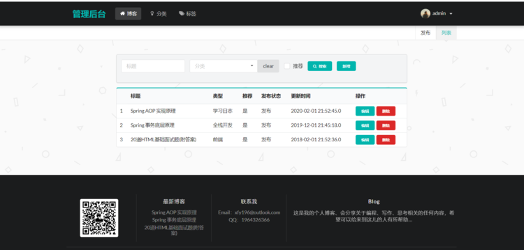

- 博客编辑功能

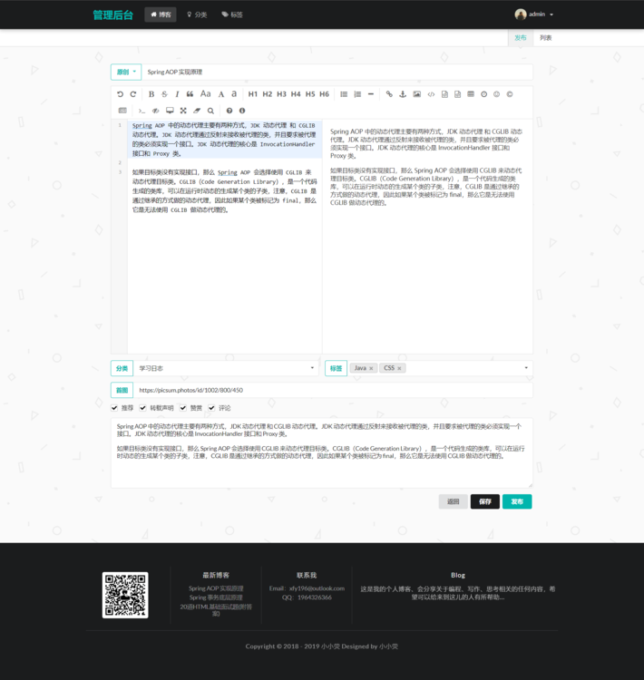

- 博客搜索功能

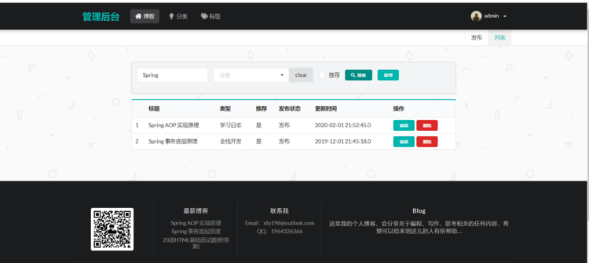

- 分类展示功能

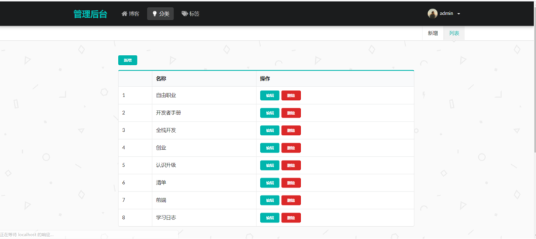

- 标签展示功能

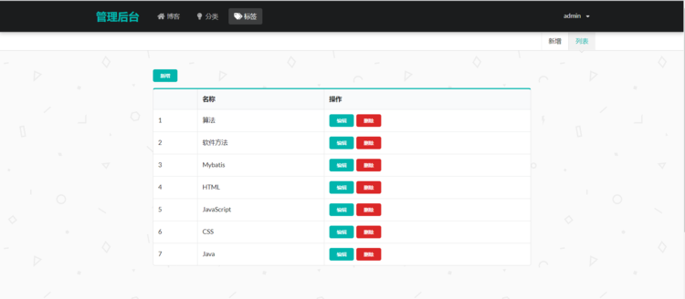

- 修改密码功能

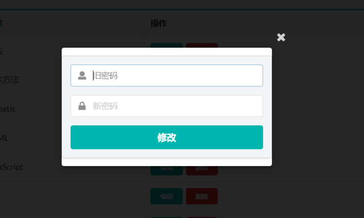

### 用户端展示功能

- 博客首页

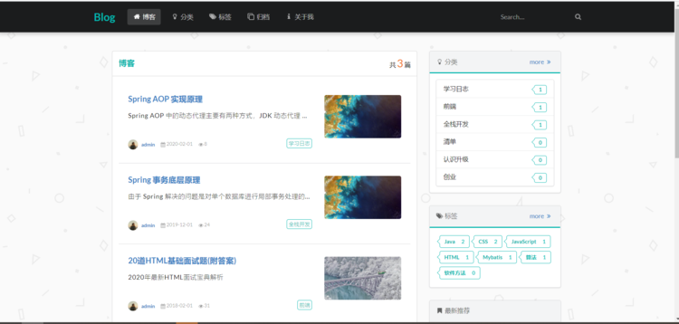

博客首页右侧会展示分类，会按照每个分类对应的博客数量倒序排序，还有标签和罪行推荐，最新推荐按照更新时间倒序排序

- 按分类展示文章

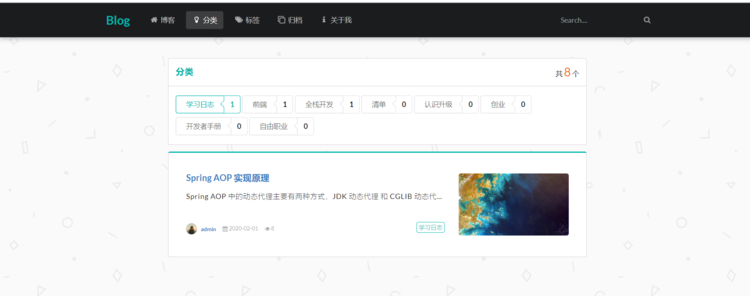

- 按标签展示文章

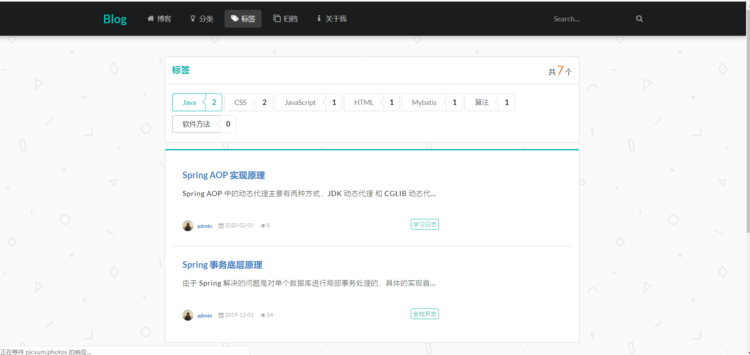

- 归档（按照时间进行排序显示）

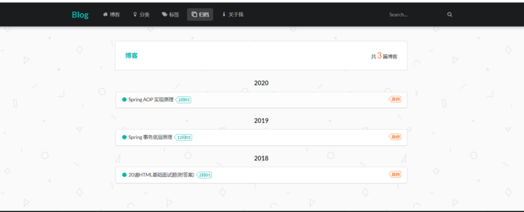

- 关于我

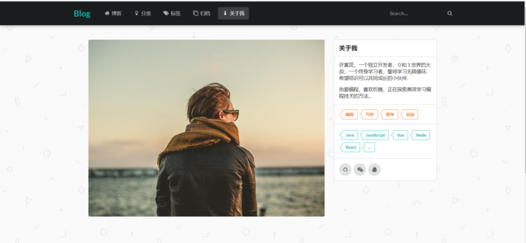

- 博客搜索功能

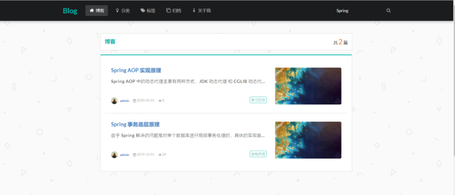

### 关于如何部署在服务器中

- 首先我们需要创建一个虚拟机，搭建使用Centos7版本的环境

  ```txt
  虚拟机安装完成后我们需要查看防火墙状态
  ```

  

  ```shell
  systemctl status firwalld
  ```

  

  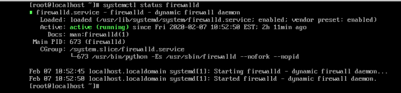

关闭防火墙

```shell
systemctl stop firewalld
```

重新查看防火墙状态

```shell
systemctl status firwalld
```


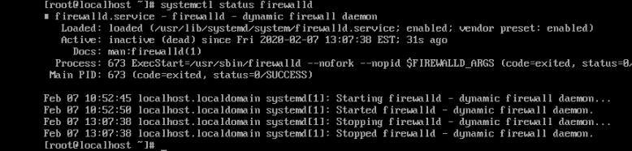


安装Mysql

- 首先我们需要卸载Centos7自带的mariadb数据库

```shell
yum remove -y mariadb*
```

#### 重新安装mysql

```shell
由于Centos7yum源不再支持mysql版本，因此我们需要借助wget通过rpm安装
# yum install -y wget

# wget -i -c http://dev.mysql.com/get/mysql57-community-release-el7-10.noarch.rpm
# yum -y install mysql57-community-release-el7-10.noarch.rpm
```

#### 安装mysql服务器

```shell
yum -y install mysql-community-server
```

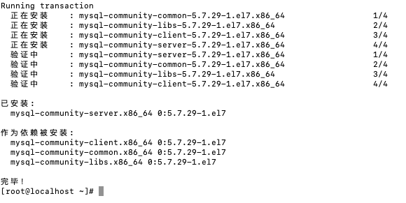

#### 启动Mysql服务和查看服务是否正常启动

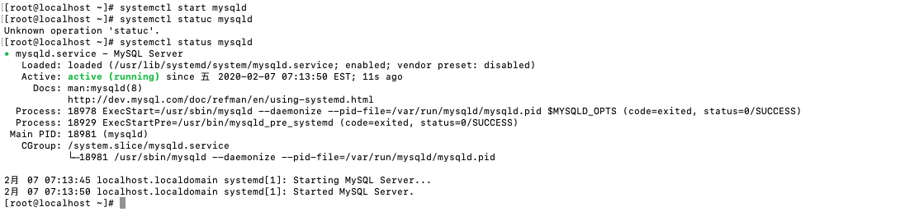


#### 查看mysql初始密码

```shell
grep "password" /var/log/mysqld.log
```

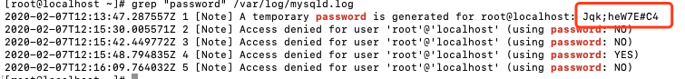

#### 进入数据库

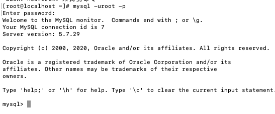

#### 修改root用户密码

```shell
ALTER USER 'root'@'localhost' IDENTIFIED BY 'new password';
```

#### 由于密码存在拟定的安全验证可能无法这只较短或着比较简单的数据，可以按照以下方法进行修改

```shell
set global validate_password_policy=0;
set global validate_password_length=1;
```

设置之后密码就可以设置如123456这样的密码了

#### 重新设置密码

```shell
ALTER USER 'root'@'localhost' IDENTIFIED BY 'new password';
```

> 扩展： Mysql完整的初始密码规则可以通过以下命令查看
>
> SHOW VARIABLES LIKE ‘validate_password%’;（注意如果mysql没有取消忽略大小写规则，是带有大小写问题的）

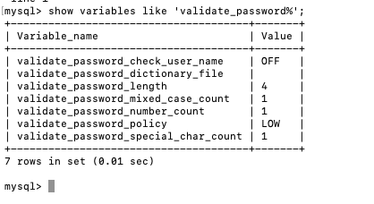

#### 接下来你可以使用第三方工具连接你的数据库了

但是这是后我们的连接工具会出现错误

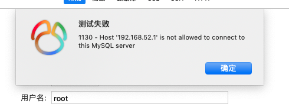

我们需要让mysql服务器可以远程连接

```shell
mysql -uroot -p
use mysql;
select user, host from where user;
update user set host= '%'  WHERE user ='root';
flush privileges;
```

这时候我们就连接成功了

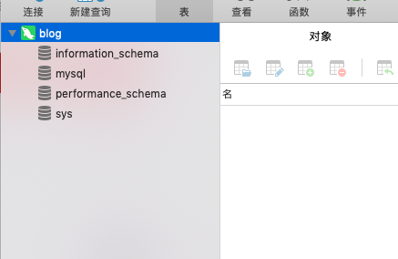

然后创建一个名为blog的数据库


#### 导入bolg数据初始化文件


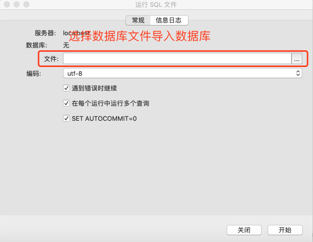


### 安装tomcat服务

[tomcat官网下载地址](http://tomcat.apache.org/)

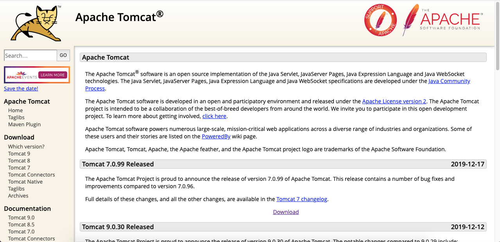

这里我们选择tomcat9.0.30版本

上传服务器中

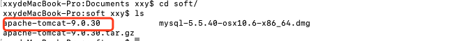

```shell
# 解压
tar zxvf apache-tomcat-9.0.30.tar.gz
# 进入apache的webapps目录
cd apache-tomcat-9.0.30/webapps/
# 将blog.war放在这个目录下
# 进入bin目录下启动Apache服务
cd ../bin
# 启动服务
./start.sh
```

浏览器访问localhost:8080

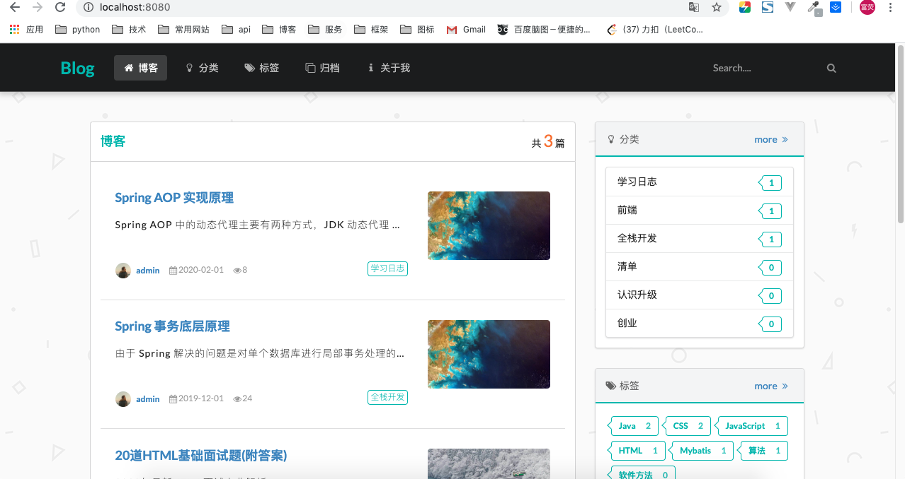

博客管理路径为localhost:8080/admin

初始账号：admin

初始密码：123456

如果需要更改端口，上下文路径，和域名，具体参考tomcat使用手册和域名配置手册
